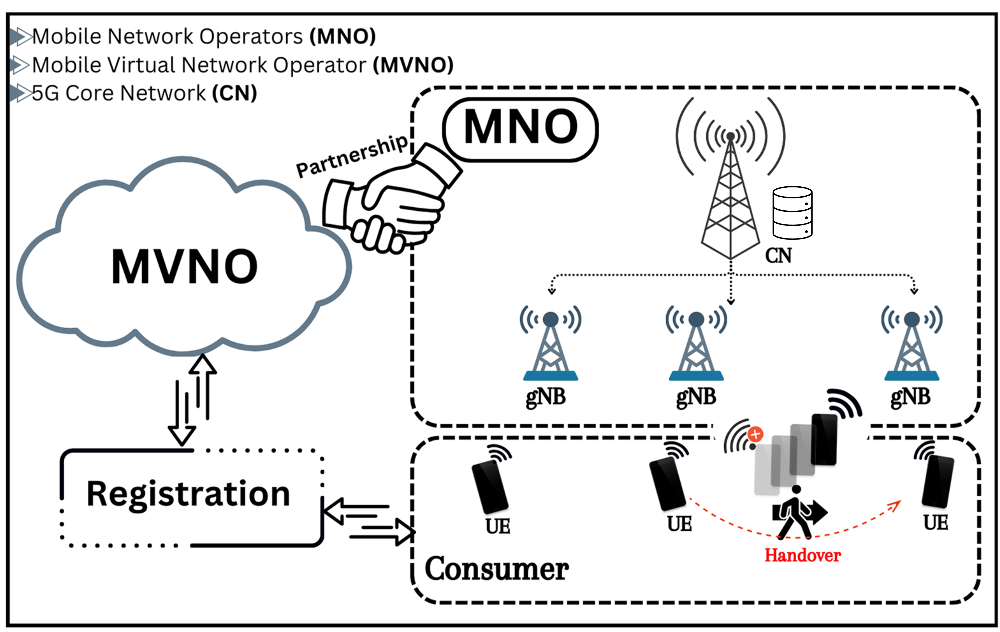

# Strong Privacy-Preserving Universally Composable AKA Protocol with Seamless Handover Support for Mobile Virtual Network Operator (CCS 2024)

### [Paper](https://arxiv.org/abs/2409.04877) | [Bibtex](#bibtex)

Rabiah Alnashwan \* $^1$, Yang Yang \*$^†{^2}$, Yilu Dong $^3$, Prosanta Gope $^†{^1}$, Behzad Abdolmaleki $^1$, Syed Rafiul Hussain $^3$.


(* Equal contribution, $†$ Corresponding Author.)

$^1$ The University of Sheffield, $^2$ National University of Singapore, $^3$ The Pennsylvania State University.



## Abstract
<!-- **Abstract** -->

Consumers seeking a new mobile plan have many choices in the present mobile landscape. The Mobile Virtual Network Operator (MVNO) has recently gained considerable attention among these options. MVNOs offer various benefits, making them an appealing choice for a majority of consumers. These advantages encompass flexibility, access to cutting-edge technologies, enhanced coverage, superior customer service, and substantial cost savings.  Even though MVNO offers several advantages, it simultaneously creates critical security and privacy concerns for the customer. For instance, in the existing solution, MVNO needs to hand over all the sensitive details, including the users' identities and master secret keys of their customers, to a mobile operator (MNO) to validate the customers while offering any services. This allows MNOs to have unrestricted access to the MVNO subscribers' location and mobile data, including voice calls, SMS, and Internet, which the MNOs frequently sell to third parties (e.g., advertisement companies and surveillance agencies) for more profit. Although critical for mass users, such privacy loss has been historically ignored due to the lack of practical and privacy-preserving solutions for registration and handover procedures in cellular networks. In this paper, we propose a universally composable authentication and handover scheme with strong user privacy support, where each MVNO user can validate a mobile operator (MNO) and vice-versa without compromising user anonymity and unlinkability support.  Here, we anticipate that our proposed solution will most likely be deployed by the MVNO(s) to ensure enhanced privacy support to their customer(s).  


## OAI gNB and OAI nrUE


Please read and check the full instructions about OpenAirInterface(OAI) as described here:
[OAI](https://gitlab.eurecom.fr/oai/openairinterface5g/-/blob/develop/doc/NR_SA_Tutorial_OAI_nrUE.md?ref_type=heads&plain=0)


### Minimum hardware requirements:
- Laptop/Desktop/Server for OAI CN5G and OAI gNB
    - Operating System: [Ubuntu 24.04 LTS](https://releases.ubuntu.com/24.04/ubuntu-24.04.1-desktop-amd64.iso)
    - CPU: 8 cores x86_64 @ 3.5 GHz
    - RAM: 32 GB
- Laptop for UE
    - Operating System: [Ubuntu 24.04 LTS](https://releases.ubuntu.com/24.04/ubuntu-24.04.1-desktop-amd64.iso)
    - CPU: 8 cores x86_64 @ 3.5 GHz
    - RAM: 8 GB
- [USRP B210](https://www.ettus.com/all-products/ub210-kit/), [USRP N300](https://www.ettus.com/all-products/USRP-N300/) or [USRP X300](https://www.ettus.com/all-products/x300-kit/)
    - Please identify the network interface(s) on which the USRP is connected and update the gNB configuration file


### Build UHD from source
```bash
# https://files.ettus.com/manual/page_build_guide.html
sudo apt install -y autoconf automake build-essential ccache cmake cpufrequtils doxygen ethtool g++ git inetutils-tools libboost-all-dev libncurses-dev libusb-1.0-0 libusb-1.0-0-dev libusb-dev python3-dev python3-mako python3-numpy python3-requests python3-scipy python3-setuptools python3-ruamel.yaml

git clone https://github.com/EttusResearch/uhd.git ~/uhd
cd ~/uhd
git checkout v4.7.0.0
cd host
mkdir build
cd build
cmake ../
make -j $(nproc)
make test # This step is optional
sudo make install
sudo ldconfig
sudo uhd_images_downloader
```


### Build OAI gNB and OAI nrUE

```bash
cd ~/openairinterface5g/cmake_targets
./build_oai -w USRP --ninja --nrUE --gNB --build-lib "nrscope" -C
```

### Run OAI CN5G

```bash
cd ~/oai-cn5g
docker compose up -d
```

### Run OAI gNB on USRP B210
```bash
cd ~/openairinterface5g/cmake_targets/ran_build/build
sudo ./nr-softmodem -O ../../../targets/PROJECTS/GENERIC-NR-5GC/CONF/gnb.sa.band78.fr1.106PRB.usrpb210.conf --gNBs.[0].min_rxtxtime 6 --sa -E --continuous-tx
```

### Run OAI nrUE on USRP B210
Important notes:
- This should be run in a second Ubuntu 22.04 host, other than gNB
- It only applies when running OAI gNB with USRP B210

Run OAI nrUE with USRP B210
```bash
cd ~/openairinterface5g/cmake_targets/ran_build/build
sudo ./nr-uesoftmodem -r 106 --numerology 1 --band 78 -C 3619200000 --ue-fo-compensation --sa -E --uicc0.imsi 001010000000001
```


<a name="bibtex"></a>
## Citation

If you find our work or any of our materials useful, please cite our papers:
```

@misc{alnashwan2024strong,
      title={Strong Privacy-Preserving Universally Composable AKA Protocol with Seamless Handover Support for Mobile Virtual Network Operator}, 
      author={Alnashwan, Rabiah and Yang, Yang and Dong, Yilu and Gope, Prosanta and Abdolmaleki, Behzad and Hussain, Syed Rafiul},
      year={2024},
      eprint={2409.04877},
      archivePrefix={arXiv},
      primaryClass={cs.CR}
}

```


## Acknowledgements

We thank [OpenAirInterface](https://openairinterface.org/), developers for making their tools publicly available. Our code modifies these tools to implement our protocol.  
